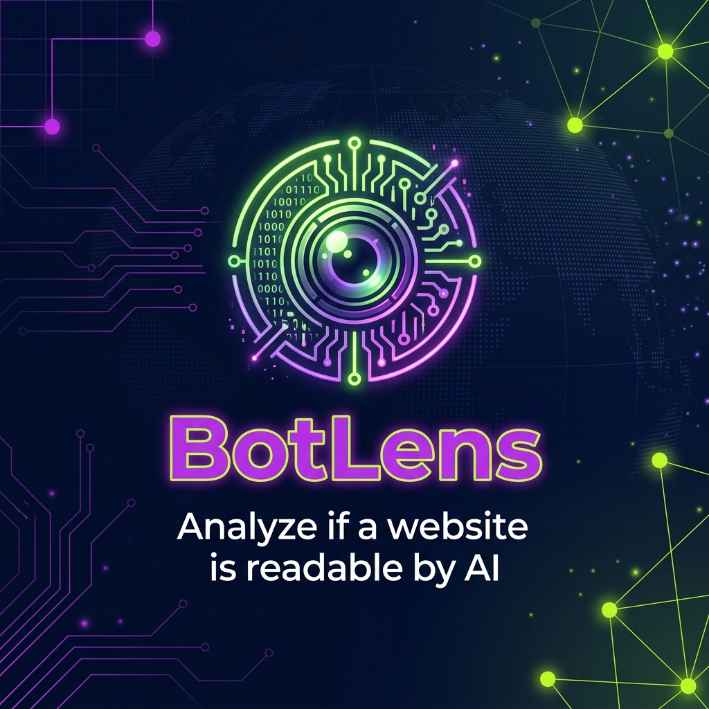

# BotLens 🕵️‍♂️🤖

**BotLens** is a Chrome Extension that analyzes whether a website can be read and accessed by AI systems (LLMs, crawlers, and bots). It provides a clear, actionable readability score and a technical breakdown of how bots see your content.

**Website:** [botlens.iamjarl.com](https://botlens.iamjarl.com)

---

## 🎯 The Goal

As the web becomes increasingly AI-native, a new question arises: **"Can AI read this?"**. 

BotLens helps developers and site owners answer this by inspecting technical signals—like `robots.txt`, meta tags, and semantic structure—that determine whether systems like GPTBot, Googlebot, or ClaudeBot can effectively interpret a page.

---

## 🧩 Key Features

- **AI Readability Score**: A weighted 0-100 score based on technical and semantic signals.
- **Robots.txt & Meta Analysis**: Real-time parsing of crawling rules and bot-specific directives.
- **Semantic Structure Check**: Validates heading hierarchy and HTML5 semantic tags.
- **JS-Heavy Detection**: Identifies if content is hidden behind heavy client-side rendering.
- **Premium UI**: Built with the **IAMJARL Design System** for a sleek, mode-aware experience.

---

## 🏗️ Technical Stack

- **Manifest V3**
- **Vanilla JavaScript** (No frameworks, high performance)
- **Design System**: [IAMJARL Design Tokens](https://github.com/JarlLyng/iamjarl-design)
- **Icons**: Phosphor Icons

---

## 🚀 Getting Started

### Installation
1. Clone this repository.
2. Open Chrome and navigate to `chrome://extensions/`.
3. Enable **Developer Mode**.
4. Click **Load unpacked** and select the project folder.

### Development
Keep logic modular and follow the design tokens in `tokens.css`. 

---

## 🧑‍💻 Built By

BotLens is created and maintained by **[iamjarl](https://iamjarl.com)**. 

I build tools that bridge the gap between human experience and AI infrastructure. Check out my other projects and design systems at [iamjarl.com](https://iamjarl.com).

---

## 📄 License

This project is licensed under the MIT License - see the [LICENSE](LICENSE) file for details.